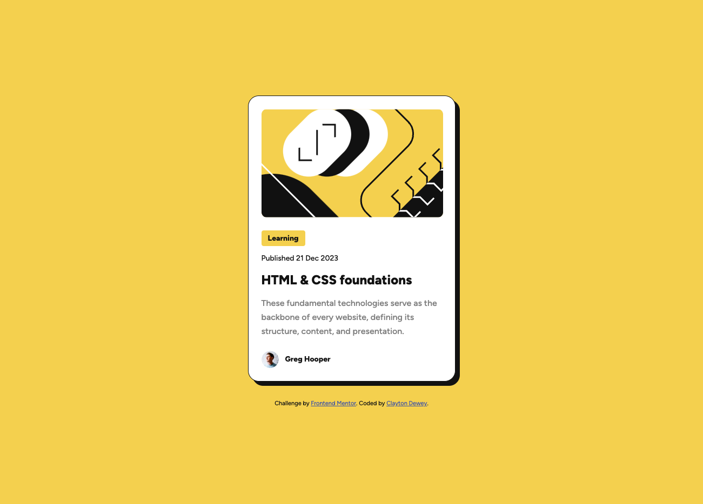

# Frontend Mentor - Blog preview card solution

This is a solution to the [Blog preview card challenge on Frontend Mentor](https://www.frontendmentor.io/challenges/blog-preview-card-ckPaj01IcS). Frontend Mentor challenges help you improve your coding skills by building realistic projects.

## Table of contents

- [Overview](#overview)
  - [The challenge](#the-challenge)
  - [Screenshot](#screenshot)
  - [Links](#links)
- [My process](#my-process)
  - [Built with](#built-with)
- [Author](#author)

**Note: Delete this note and update the table of contents based on what sections you keep.**

## Overview

### The challenge

Users should be able to:

- See hover and focus states for all interactive elements on the page

### Screenshot

### Links

- Solution URL: [github.com/ClaytonDewey/fem-blog-preview](https://github.com/ClaytonDewey/fem-blog-preview)
- Live Site URL: [claytondewey.github.io/fem-blog-preview](https://claytondewey.github.io/fem-blog-preview/)

## My process

### Built with

- Accessibility
- Semantic HTML5 markup
- CSS custom properties
- Flexbox
- Mobile-first workflow

### Continued development

Use this section to outline areas that you want to continue focusing on in future projects. These could be concepts you're still not completely comfortable with or techniques you found useful that you want to refine and perfect.

**Note: Delete this note and the content within this section and replace with your own plans for continued development.**

### Useful resources

- [Example resource 1](https://www.example.com) - This helped me for XYZ reason. I really liked this pattern and will use it going forward.
- [Example resource 2](https://www.example.com) - This is an amazing article which helped me finally understand XYZ. I'd recommend it to anyone still learning this concept.

**Note: Delete this note and replace the list above with resources that helped you during the challenge. These could come in handy for anyone viewing your solution or for yourself when you look back on this project in the future.**

## Author

- Website - [Clayton Dewey](https://www.claytondewey.com)
- Frontend Mentor - [@ClaytonDewey](https://www.frontendmentor.io/profile/ClaytonDewey)
- Twitter - [@ClaytonDewey](https://www.twitter.com/ClaytonDewey)
